# Iris-Clustering
This project is based on the clustering of Iris family of plants on the basis of size of the Petal and Sepal of the Iris Plant. 
   
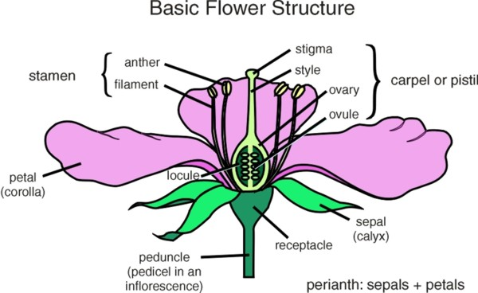
   
Visual representation of clustering shown below.
  
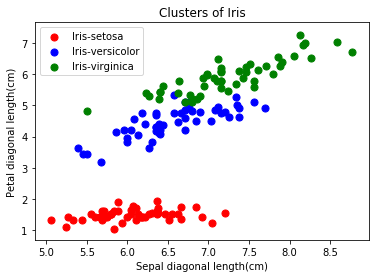
  
Few scatter plots
  
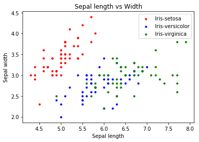
  
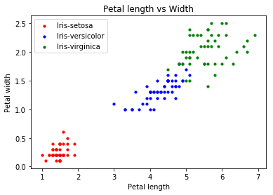
  
Few Box Plots
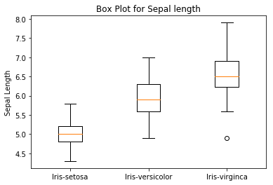
  
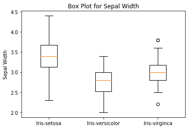
  
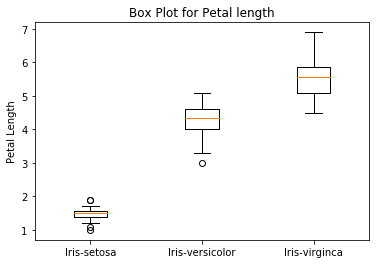
  
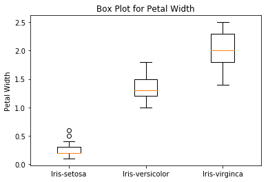
  
Few Violin Plots
  
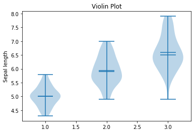
  
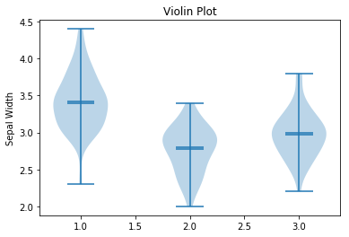
  
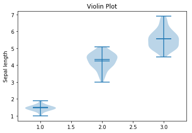
  
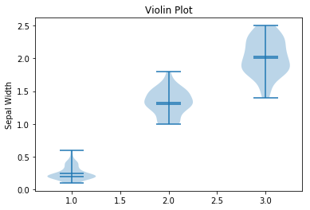

